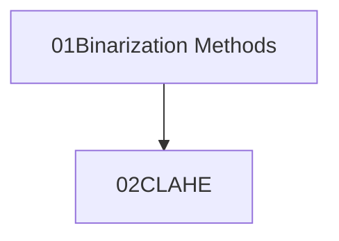

# Computer Vision

<!-- Heading
=
Subheading
-
# heading
## subheading
paragraph1

paragragh2

p1
p2

p1  
p2  
_italic_  
**bold**  
___
___
___
`monospaceasdf`  
123  
* 1
* 2
* 3  

456
- 4
- 5
- 6 -->
